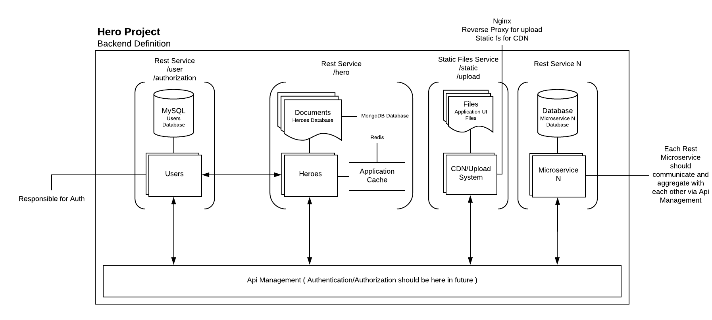

# Hero Project

> A system to manage heroes

## Architecture

> Hero backend definition

The image above is a reference to all the services of hero project and his architecture definition.



* Any Guard System  should send a authorization request to `Users Microservice` (see the image) containing a Token and Resource string

* Each Microservice should use env variables to define Integrations URI. For Example:

```
BASE_PATH=protocol://doma.in
AUTH_ENDPOINT=/authorization
```

* Rest microservices should not use endpoint with plural resource names
    
    * /users (WRONG)
    * /user (CORRECT)
    * /user/:id (CORRECT)

## Modules

* [Api Management](./docs/api-management/api-management.md)
* [Users](./docs/users/users.md)